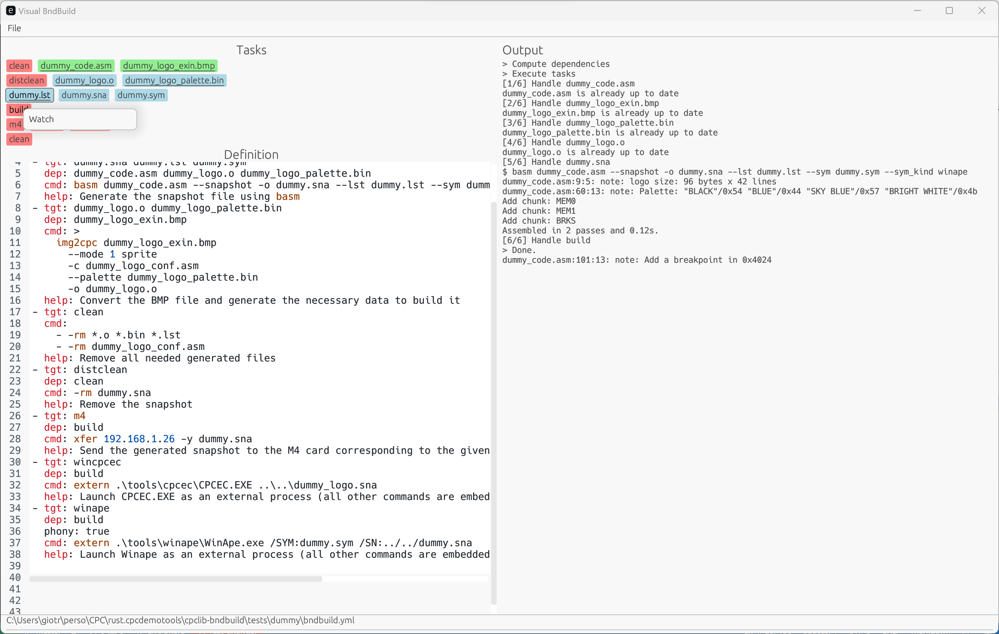

# Visual Bndbuild

This is the graphical frontend of the [bndbuild system](../cpclib-bndbuild/).
The functionalities are exactly the same, except it does not requires to handle the command line, just to click on appropriate buttons.

Here is an example on the [dummy project](../cpclib-bndbuild/tests/dummy/)

