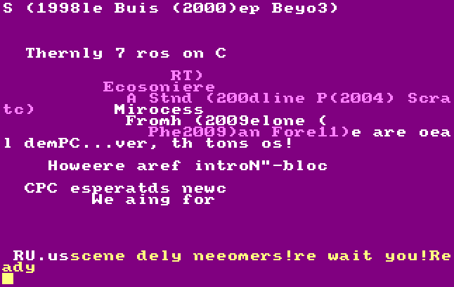

# Catalog CatArt Examples

> **Note:** All examples below use real DSK files from the test suite and show actual command outputs.

## Listing Catalog Content

### List Files (No Control Characters)

The `list` command shows only files with printable names:

```bash
catalog BLOCUS.DSK list
```

**Real Output:**
```
2026-02-17T22:54:06.703Z ERROR [cpclib_catalog] Current implementation is buggy when using dsks. Please extract first the catalog with another tool for real results.
14. 0:-BLOC.US [hidden]    5Kb [Index(2), Index(3), Index(4), Index(5), Index(6)]
36. 0:BLOCUS.001 [hidden]   16Kb [Index(7), Index(8), Index(9), Index(10), Index(11), Index(12), Index(13), Index(14), Index(15), Index(16), Index(17), Index(18), Index(19), Index(20), Index(21), Index(22)]
37. 0:BLOCUS.002 [hidden]   16Kb [Index(23), Index(24), Index(25), Index(26), Index(27), Index(28), Index(29), Index(30), Index(31), Index(32), Index(33), Index(34), Index(35), Index(36), Index(37), Index(38)]
38. 0:BLOCUS.003 [hidden]   16Kb [Index(39), Index(40), Index(41), Index(42), Index(43), Index(44), Index(45), Index(46), Index(47), Index(48), Index(49), Index(50), Index(51), Index(52), Index(53), Index(54)]
39. 0:BLOCUS.004 [hidden]   16Kb [Index(55), Index(56), Index(57), Index(58), Index(59), Index(60), Index(61), Index(62), Index(63), Index(64), Index(65), Index(66), Index(67), Index(68), Index(69), Index(70)]
```

### List All Files (Including CatArt Entries)

The `listall` command shows ALL entries, including CatArt graphics data:

```bash
catalog BLOCUS.DSK listall
```

**Real Output (first 20 entries):**
```
2026-02-17T22:54:34.583Z ERROR [cpclib_catalog] Current implementation is buggy when using dsks. Please extract first the catalog with another tool for real results.
0. => CAT ART <=
1. => CAT ART <=
2. => CAT ART <=
3. => CAT ART <=
4. => CAT ART <=
5. => CAT ART <=
6. => CAT ART <=
7. => CAT ART <=
8. => CAT ART <=
9. => CAT ART <=
10. => CAT ART <=
11. => CAT ART <=
12. => CAT ART <=
13. => CAT ART <=
14. 0:-BLOC.US [hidden]    5Kb [Index(2), Index(3), Index(4), Index(5), Index(6)]
15. => CAT ART <=
16. => CAT ART <=
17. => CAT ART <=
18. => CAT ART <=
19. => CAT ART <=
```

The `=> CAT ART <=` entries are the graphical catalog display data.

### List Files from a Regular Disk

Example with CATA.DSK which contains BASIC and text files:

```bash
catalog CATA.DSK list
```

**Real Output:**
```
2026-02-17T22:55:01.869Z ERROR [cpclib_catalog] Current implementation is buggy when using dsks. Please extract first the catalog with another tool for real results.
0. 0:-0TO31.BAS    1Kb [Index(2)]
1. 0:-CATA.BAS    7Kb [Index(3), Index(4), Index(5), Index(6), Index(7), Index(8), Index(9)]
2. 0:464BAD.BAS    1Kb [Index(10)]
3. 0:464BAD.TXT    1Kb [Index(11)]
4. 0:464GOOD.BAS    1Kb [Index(12)]
5. 0:464GOOD.TXT    1Kb [Index(13)]
6. 0:CATA2.BAS    6Kb [Index(14), Index(15), Index(16), Index(17), Index(18), Index(19)]
7. 0:CATA3.BAS    7Kb [Index(20), Index(21), Index(22), Index(23), Index(24), Index(25), Index(26)]
8. 0:FORCE1.BAS    1Kb [Index(27)]
9. 0:FORCE1.TXT    1Kb [Index(28)]
10. 0:MODE0.BAS    1Kb [Index(29)]
11. 0:MODE0.TXT    1Kb [Index(30)]
12. 0:MODE1.BAS    1Kb [Index(31)]
13. 0:MODE1.TXT    1Kb [Index(32)]
14. 0:MODE2.BAS    1Kb [Index(33)]
15. 0:MODE2.TXT    1Kb [Index(34)]
16. 0:CATA-FR.TXT   16Kb [Index(35), Index(36), Index(37), Index(38), Index(39), Index(40), Index(41), Index(42), Index(43), Index(44), Index(45), Index(46), Index(47), Index(48), Index(49), Index(50)]
17. 0:CATA-FR.TXT    1Kb [Index(51)]
18. 0:CATA-UK.TXT   15Kb [Index(52), Index(53), Index(54), Index(55), Index(56), Index(57), Index(58), Index(59), Index(60), Index(61), Index(62), Index(63), Index(64), Index(65), Index(66)]
19. 0:-T5.BAS    2Kb [Index(67), Index(68)]
20. 0:T5.ASC    2Kb [Index(69), Index(70)]
21. 0:-T6.BAS    2Kb [Index(71), Index(72)]
22. 0:T6.ASC    2Kb [Index(73), Index(74)]
23. 0:-T7.BAK    2Kb [Index(75), Index(76)]
24. 0:T7.BAK    2Kb [Index(77), Index(78)]
25. 0:-T7.BAS    2Kb [Index(79), Index(80)]
26. 0:T7.ASC    2Kb [Index(81), Index(82)]
27. 0:-T8.BAS    2Kb [Index(83), Index(84)]
28. 0:T8.ASC    2Kb [Index(85), Index(86)]
```

Note: Files prefixed with `-` are hidden (system) files.

## Viewing CatArt Graphics

### Display CatArt to Terminal

The `cat` command displays the graphical catalog in your terminal:

```bash
catalog BLOCUS.DSK cat
```

**Real Output:**
```
                                                
                                                
                                                
                                                
                                                
                                                
                                                
      There are only 7 real demos on CPC...     
                                                
```

This command renders the CatArt using ANSI terminal graphics.

### Generate PNG Image of CatArt

The `cat` and `dir` commands support `--png` to export pixel-accurate renderings:

```bash
# Generate PNG of sorted catalog
catalog BLOCUS.DSK cat --png blocus_catalog.png

# Generate PNG of directory listing
catalog BLOCUS.DSK dir --png blocus_directory.png

# Generate PNG with specific mode and locale
catalog BLOCUS.DSK cat --png catalog_mode0.png --mode 0 --locale french
```

**PNG Output:**
Creates a pixel-accurate PNG image showing exactly how the CatArt would appear on a real Amstrad CPC screen, including:
- Correct CPC color palette
- Authentic screen modes (0, 1, 2, or 3)
- Proper font rendering based on locale (English, French, Spanish, German, Danish)

**Example Catalog Rendering (sorted alphabetically):**


**Example Directory Listing (unsorted, directory order):**



## Building CatArt Disks

### Build from ASCII Source

Create a CatArt disk from an ASCII BASIC source file:

```bash
catalog T8.ASC build -o catart.dsk
```

**Real Output:**
```
2026-02-17T22:57:32.565Z INFO  [cpclib_catalog]
=== BASIC PROGRAM BYTE COMPARISON ===
2026-02-17T22:57:32.566Z INFO  [cpclib_catalog] Original BASIC program: 129 commands -> 319 bytes
2026-02-17T22:57:32.566Z INFO  [cpclib_catalog] Reconstructed BASIC program: 130 commands -> 320 bytes

Success! Created catart.dsk (204544 bytes)
```

### Build and Generate PNG Preview

Build a CatArt disk and simultaneously generate a PNG preview:

```bash
# Build DSK with PNG preview
catalog T8.ASC build -o catart.dsk --png preview.png

# Build with specific mode and locale
catalog T8.ASC build -o catart.dsk --png preview.png --mode 0 --locale french
```

This creates both the DSK file and a PNG image showing how the CatArt will look.

The build process:
1. Parses the ASCII BASIC source
2. Generates CatArt commands
3. Creates a working BASIC program
4. Writes it to a DSK file

### Understanding CatArt

CatArt is a technique where the Amstrad CPC file catalog itself contains BASIC commands that draw graphics when listed. The tool processes BASIC programs and converts them into special catalog entries that create visual effects.

## Important Notes

1. **DSK Processing Warning**: The tool currently shows a warning about DSK handling being buggy. For production use, extract the catalog binary first with another tool.

2. **File Number Format**: The output format shows:
   - Entry number (e.g., `14.`)
   - User number (e.g., `0:`)
   - Filename (e.g., `-BLOC.US`)
   - Attributes (`[hidden]`, `[system]`, `[readonly]`)
   - Size in KB
   - Block allocation (`[Index(2), Index(3), ...]`)

3. **CatArt Entries**: Entries marked `=> CAT ART <=` are not real files but graphical data that creates the visual catalog display.

## Available Commands

Run `catalog --help` to see all commands:

```bash
catalog --help
```

**Available Commands:**
- `cat` - Display catalog with CatArt rendering (sorted alphabetically)
- `dir` - Display catalog in directory order (unsorted)
- `list` - List content (files with printable names only)
- `listall` - List all content (including control characters)
- `build` - Build catart from BASIC program
- `decode` - Extract BASIC listing from catalog
- `modify` - Modify catalog entries
- `debug` - Debug catart structure
